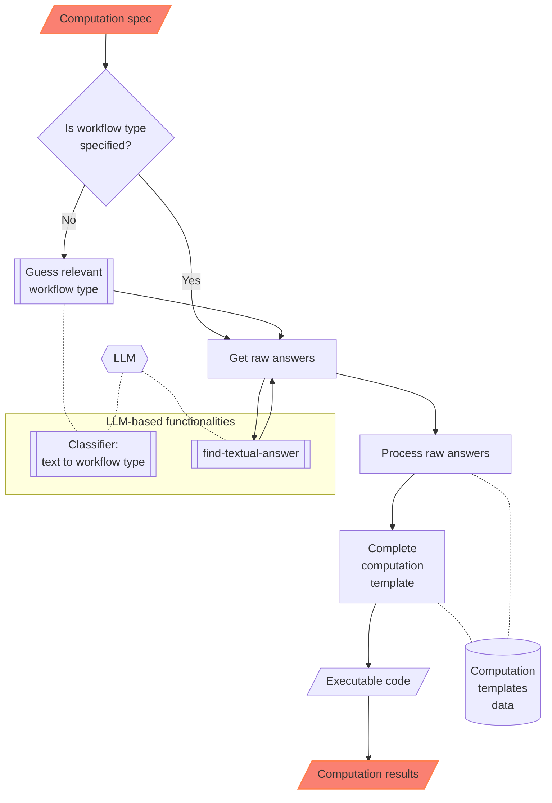

# ML::NLPTemplateEngine

This Raku package aims to create (nearly) executable code for various computational workflows.

Package's data and implementation make a Natural Language Processing (NLP)
[Template Engine (TE)](https://en.wikipedia.org/wiki/Template_processor), [Wk1],
that incorporates
[Question Answering Systems (QAS')](https://en.wikipedia.org/wiki/Question_answering), [Wk2],
and Machine Learning (ML) classifiers.

The current version of the NLP-TE of the package heavily relies on Large Language Models (LLMs) for its QAS component.

Future plans involve incorporating other types of QAS implementations.

The Raku package implementation closely follows the Wolfram Language (WL) implementations in
["NLP Template Engine"](https://github.com/antononcube/NLP-Template-Engine), [AAr1, AAv1],
and the WL paclet
["NLPTemplateEngine"](https://resources.wolframcloud.com/PacletRepository/resources/AntonAntonov/NLPTemplateEngine/), [AAp2, AAv2].

An alternative, more comprehensive approach to building workflows code is given in [AAp2].
Another alternative is to use few-shot training of LLMs with examples provided by, say,
the Raku package ["DSL::Examples"](https://raku.land/zef:antononcube/DSL::Examples), [AAp3].

### Problem formulation

We want to have a system (i.e. TE) that:

1. Generates relevant, correct, executable programming code based on natural language specifications of computational
   workflows

2. Can automatically recognize the workflow types

3. Can generate code for different programming languages and related software packages

The points above are given in order of importance; the most important are placed first.

### Reliability of results

One of the main reasons to re-implement the WL NLP-TE, [AAr1, AAp1], into Raku is to have a more robust way
of utilizing LLMs to generate code. That goal is more or less achieved with this package, but
YMMV -- if incomplete or wrong results are obtained run the NLP-TE with different LLM parameter settings
or different LLMs.

------

## Installation

From Zef ecosystem:

```
zef install ML::NLPTemplateEngine;
```

From GitHub:

```
zef install https://github.com/antononcube/Raku-ML-NLPTemplateEngine.git
```

-----

## Usage examples

### Quantile Regression (WL)

Here the template is automatically determined:

```raku
use ML::NLPTemplateEngine;

my $qrCommand = q:to/END/;
Compute quantile regression with probabilities 0.4 and 0.6, with interpolation order 2, for the dataset dfTempBoston.
END

concretize($qrCommand);
```

```
# qrObj=
# QRMonUnit[dfTempBoston]⟹
# QRMonEchoDataSummary[]⟹
# QRMonQuantileRegression[12, {0.4,0.6}, InterpolationOrder->2]⟹
# QRMonPlot["DateListPlot"->False,PlotTheme->"Detailed"]⟹
# QRMonErrorPlots["RelativeErrors"->False,"DateListPlot"->False,PlotTheme->"Detailed"];
```

**Remark:** In the code above the template type, "QuantileRegression", was determined using an LLM-based classifier.

### Latent Semantic Analysis (R)

```raku
my $lsaCommand = q:to/END/;
Extract 20 topics from the text corpus aAbstracts using the method NNMF. 
Show statistical thesaurus with the words neural, function, and notebook.
END

concretize($lsaCommand, template => 'LatentSemanticAnalysis', lang => 'R');
```

```
# lsaObj <-
# LSAMonUnit(aAbstracts) %>%
# LSAMonMakeDocumentTermMatrix(stemWordsQ = Automatic, stopWords = Automatic) %>%
# LSAMonEchoDocumentTermMatrixStatistics(logBase = 10) %>%
# LSAMonApplyTermWeightFunctions(globalWeightFunction = "IDF", localWeightFunction = "None", normalizerFunction = "Cosine") %>%
# LSAMonExtractTopics(numberOfTopics = 20, method = "NNMF", maxSteps = 16, minNumberOfDocumentsPerTerm = 20) %>%
# LSAMonEchoTopicsTable(numberOfTerms = 10, wideFormQ = TRUE) %>%
# LSAMonEchoStatisticalThesaurus(words = c("neural", "function", "notebook"))
```

### Random tabular data generation (Raku)

```raku
my $command = q:to/END/;
Make random table with 6 rows and 4 columns with the names <A1 B2 C3 D4>.
END

concretize($command, template => 'RandomTabularDataset', lang => 'Raku', llm => 'ollama');
```

```
# random-tabular-dataset(6, 4, "column-names-generator" => <A1 B2 C3 D4>, "form" => "table", "max-number-of-values" => 24, "min-number-of-values" => 24, "row-names" => False)
```

**Remark:** In the code above it was specified to use Google's Gemini LLM service.

### Recommender workflow (Raku)

```raku
my $command = q:to/END/;
Make a commander over the data set @dsTitanic and compute 8 recommendations for the profile (passengerSex:male, passengerClass:2nd).
END

concretize($command, lang => 'Raku');
```

```
# my $smrObj = ML::SparseMatrixRecommender.new
# .create-from-wide-form(@dsTitanic, item-column-name='id', :add-tag-types-to-column-names, tag-value-separator=':')
# .apply-term-weight-functions('IDF', 'None', 'Cosine')
# .recommend-by-profile(["passengerSex:male", "passengerClass:2nd"], 8, :!normalize)
# .join-across(@dsTitanic)
# .echo-value();
```

------

## CLI

The package provides the Command Line Interface (CLI) script `concretize`. Here is usage note:

```shell
concretize --help
```

```
# Usage:
#   concretize.raku [<words> ...] [-t|--template=<Str>] [-l|--to|--lang=<Str>] [-c|--clipboard-command=<Str>] [--<args>=...]
#   
#     -t|--template=<Str>             Template to use. [default: 'Whatever']
#     -l|--to|--lang=<Str>            Template's language. [default: 'R']
#     -c|--clipboard-command=<Str>    Clipboard command to use. [default: 'Whatever']
#     --<args>=...                    Additional arguments for &ML::FindTextualAnswer::find-textual-answer.
```

------

## How it works?

The following flowchart describes how the NLP Template Engine involves a series of steps for processing a computation
specification and executing code to obtain results:



Here's a detailed narration of the process:

1. **Computation Specification**:
    - The process begins with a "Computation spec", which is the initial input defining the requirements or parameters
      for the computation task.

2. **Workflow Type Decision**:
    - A decision node asks if the workflow type is specified.

3. **Guess Workflow Type**:
    - If the workflow type is not specified, the system utilizes a classifier to guess relevant workflow type.

4. **Raw Answers**:
    - Regardless of how the workflow type is determined (directly specified or guessed), the system retrieves "raw
      answers", crucial for further processing.

5. **Processing and Templating**:
    - The raw answers undergo processing ("Process raw answers") to organize or refine the data into a usable format.
    - Processed data is then utilized to "Complete computation template", preparing for executable operations.

6. **Executable Code and Results**:
    - The computation template is transformed into "Executable code", which when run, produces the final "Computation
      results".

7. **LLM-Based Functionalities**:
    - The classifier and the answers finder are LLM-based.

8. **Data and Templates**:
    - Code templates are selected based on the specifics of the initial spec and the processed data.

------

## Bring your own templates

**0.** Load the NLP-Template-Engine package (and others):

```raku
use ML::NLPTemplateEngine;
use Data::Importers;
use Data::Summarizers;
```

**1.** Get the "training" templates data (from CSV file you have created or changed) for a new workflow
(["SendMail"](https://github.com/antononcube/NLP-Template-Engine/blob/main/TemplateData/dsQASParameters-SendMail.csv)):

```raku
my $url = 'https://raw.githubusercontent.com/antononcube/NLP-Template-Engine/main/TemplateData/dsQASParameters-SendMail.csv';
my @dsSendMail = data-import($url, headers => 'auto');

records-summary(@dsSendMail, field-names => <DataType WorkflowType Group Key Value>);
```

```
# +-----------------+----------------+--------------------------------+----------------------------+----------------------------------------------------------------------------------+
# | DataType        | WorkflowType   | Group                          | Key                        | Value                                                                            |
# +-----------------+----------------+--------------------------------+----------------------------+----------------------------------------------------------------------------------+
# | Questions => 48 | SendMail => 60 | All                      => 9  | Threshold            => 12 | 0.35                                                                       => 9  |
# | Defaults  => 7  |                | What it the body         => 4  | Parameter            => 12 | {_String..}                                                                => 8  |
# | Templates => 3  |                | Which email address      => 4  | TypePattern          => 12 | None                                                                       => 4  |
# | Shortcuts => 2  |                | What it the title        => 4  | ContextWordsToRemove => 12 | {"to", "email", "mail", "send", "it", "recipient", "addressee", "address"} => 4  |
# |                 |                | Who to send it to        => 4  | Template             => 3  | to                                                                         => 4  |
# |                 |                | Who to send the email to => 4  | apiKey               => 1  | _String                                                                    => 4  |
# |                 |                | What it the content      => 4  | to                   => 1  | body                                                                       => 3  |
# |                 |                | (Other)                  => 27 | (Other)              => 7  | (Other)                                                                    => 24 |
# +-----------------+----------------+--------------------------------+----------------------------+----------------------------------------------------------------------------------+
```

**2.** Add the ingested data for the new workflow (from the CSV file) into the NLP-Template-Engine:

```raku
add-template-data(@dsSendMail);
```

```
# (ParameterTypePatterns Defaults ParameterQuestions Questions Shortcuts Templates)
```

**3.** Parse natural language specification with the newly ingested and onboarded workflow ("SendMail"):

```raku
"Send email to joedoe@gmail.com with content RandomReal[343], and the subject this is a random real call."
        ==> concretize(template => "SendMail") 
```

```
# SendMail[<|"To"->{"joedoe@gmail.com"},"Subject"->"this is a random real call","Body"->RandomReal[343],"AttachedFiles"->None|>]
```

**4.** Experiment with running the generated code!

------

## TODO

- [ ] TODO Templates data
    - [ ] TODO Using JSON instead of CSV format for the templates
        - [ ] TODO Derive suitable data structure
        - [ ] TODO Implement export to JSON
        - [ ] TODO Implement ingestion
    - [ ] TODO Review wrong parameter type specifications
        - A few were found.
    - [ ] TODO New workflows
        - [ ] TODO LLM-workflows
        - [ ] TODO Clustering
        - [ ] TODO Associative rule learning
- [ ] TODO Unit tests
    - What are good ./t unit tests?
    - [ ] TODO Make ingestion ./t unit tests
    - [ ] TODO Make suitable ./xt unit tests
- [ ] TODO Documentation
    - [ ] TODO Comparison with LLM code generation using few-shot examples
    - [ ] TODO Video demonstrating the functionalities

------

## References

### Articles

[Wk1] Wikipedia entry, [Template processor](https://en.wikipedia.org/wiki/Template_processor).

[Wk2] Wikipedia entry, [Question answering](https://en.wikipedia.org/wiki/Question_answering).

### Functions, packages, repositories

[AAr1] Anton Antonov,
["NLP Template Engine"](https://github.com/antononcube/NLP-Template-Engine),
(2021-2022),
[GitHub/antononcube](https://github.com/antononcube).

[AAp1] Anton Antonov,
[NLPTemplateEngine, WL paclet](https://resources.wolframcloud.com/PacletRepository/resources/AntonAntonov/NLPTemplateEngine/),
(2023),
[Wolfram Language Paclet Repository](https://resources.wolframcloud.com/PacletRepository/).

[AAp2] Anton Antonov,
[DSL::Translators, Raku package](https://github.com/antononcube/Raku-DSL-Translators),
(2020-2025),
[GitHub/antononcube](https://github.com/antononcube).

[AAp3] Anton Antonov,
[DSL::Examples, Raku package](https://github.com/antononcube/Raku-DSL-Examples),
(2024-2025),
[GitHub/antononcube](https://github.com/antononcube).

[WRI1] Wolfram Research,
[FindTextualAnswer]( https://reference.wolfram.com/language/ref/FindTextualAnswer.html),
(2018),
[Wolfram Language function](https://reference.wolfram.com), (updated 2020).

### Videos

[AAv1] Anton Antonov,
["NLP Template Engine, Part 1"](https://youtu.be/a6PvmZnvF9I),
(2021),
[YouTube/@AAA4Prediction](https://www.youtube.com/@AAA4Prediction).

[AAv2] Anton Antonov,
["Natural Language Processing Template Engine"](https://www.youtube.com/watch?v=IrIW9dB5sRM) presentation given at
WTC-2022,
(2023),
[YouTube/@Wolfram](https://www.youtube.com/@Wolfram).
